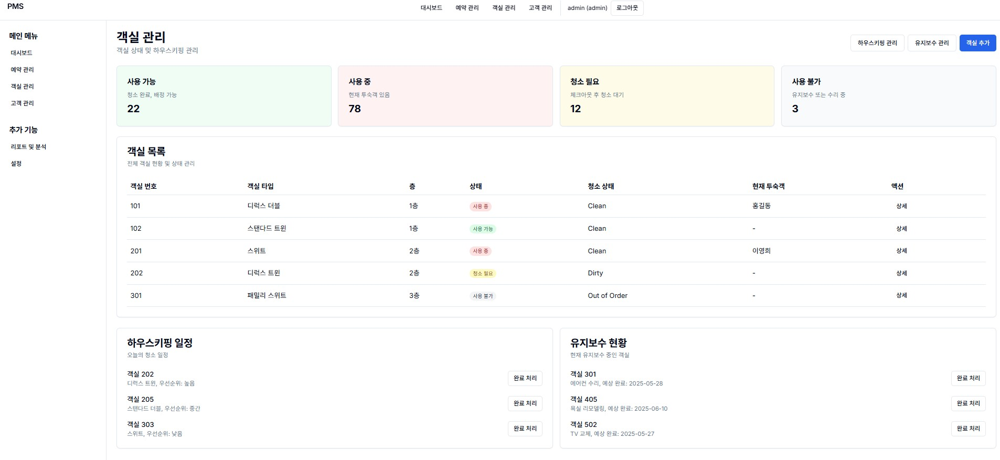

# 호텔 관리 시스템 (PMS - Property Management System)

## 테스트용 계정
admin/admin123, staff/staff123, manager/manager123

## 프로젝트 소개

이 프로젝트는 호텔 관리를 위한 종합적인 시스템으로, 객실 관리, 예약 관리, 고객 관리, 하우스키핑 관리, 유지보수 관리 등의 기능을 제공합니다. 호텔 운영에 필요한 모든 기능을 하나의 시스템에서 효율적으로 관리할 수 있도록 설계되었습니다.

## 기술 스택

- **프론트엔드**: Next.js 14.2.3, React 18, TypeScript 5
- **스타일링**: Tailwind CSS 3.4.1
- **UI 컴포넌트**: Radix UI
- **상태 관리**: React Context API
- **인증**: 커스텀 인증 시스템

## 주요 기능

### 1. 사용자 인증 시스템
- 로그인/로그아웃 기능
- 사용자 세션 관리
- 보호된 라우트 구현

### 2. 대시보드
- 호텔 운영 현황 요약 정보 제공
- 주요 지표 시각화

### 3. 객실 관리
- 객실 목록 조회 및 필터링
- 객실 상태 관리 (사용 가능, 사용 중, 청소 필요, 사용 불가)
- 객실 추가 및 수정

### 4. 예약 관리
- 예약 목록 조회 및 필터링
- 새 예약 생성
- 체크인/체크아웃 처리
- 예약 상태 관리 (확정, 대기중, 취소됨)

### 5. 고객 관리
- 고객 목록 조회 및 필터링
- 고객 정보 등록 및 수정
- VIP 고객 관리
- 고객 피드백 관리

### 6. 하우스키핑 관리
- 객실 청소 상태 관리
- 청소 일정 관리
- 담당자 배정

### 7. 유지보수 관리
- 유지보수 요청 등록 및 관리
- 유지보수 상태 추적
- 담당자 배정

## 설치 및 실행 방법

### 필수 요구사항
- Node.js 18.0.0 이상
- npm 또는 yarn

### 설치

```bash
# 저장소 클론
git clone https://github.com/jinyounghwa/pms.git
cd pms

# 프론트엔드 종속성 설치
cd frontend
yarn install
```

### 개발 서버 실행

```bash
# 프론트엔드 개발 서버 실행
cd frontend
yarn dev
```

개발 서버는 기본적으로 http://localhost:3000 에서 실행됩니다.

## 프로젝트 구조

```
pms/
├── frontend/               # 프론트엔드 코드
│   ├── public/            # 정적 파일
│   └── src/               # 소스 코드
│       ├── app/           # Next.js 앱 라우터
│       │   ├── dashboard/ # 대시보드 페이지
│       │   ├── guests/    # 고객 관리 페이지
│       │   ├── housekeeping/ # 하우스키핑 관리 페이지
│       │   ├── login/     # 로그인 페이지
│       │   ├── maintenance/ # 유지보수 관리 페이지
│       │   ├── reservations/ # 예약 관리 페이지
│       │   ├── rooms/     # 객실 관리 페이지
│       │   └── settings/  # 설정 페이지
│       ├── components/    # 재사용 가능한 컴포넌트
│       │   ├── layout/    # 레이아웃 컴포넌트
│       │   └── ui/        # UI 컴포넌트
│       ├── contexts/      # React Context
│       └── lib/           # 유틸리티 함수
└── README.md              # 프로젝트 문서
```

## 현재 개발 상태

### 완료된 기능
- 사용자 인증 시스템 (로그인/로그아웃)
- 대시보드 레이아웃 및 네비게이션
- 객실 관리 페이지
- 객실 추가 페이지
- 하우스키핑 관리 페이지
- 유지보수 관리 페이지
- 예약 관리 페이지
- 예약 생성 페이지
- 고객 관리 페이지
- 고객 등록 다이얼로그
- VIP 고객 상세 다이얼로그
- 고객 피드백 다이얼로그
- 설정 페이지

### 진행 중인 기능
- 데이터베이스 연동
- API 구현
- 실시간 알림 시스템
- 보고서 생성 및 내보내기

## 향후 계획
- 결제 시스템 통합
- 모바일 반응형 UI 개선
- 다국어 지원
- 테마 설정
- 사용자 권한 관리 시스템 강화

## LICENSE
MIT

